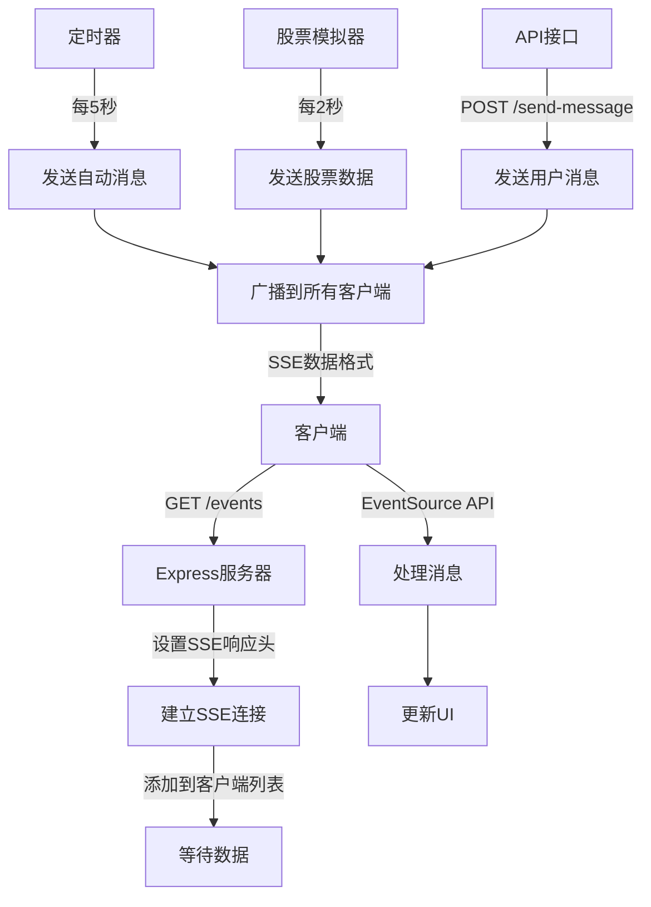

# SSE Demo - Server-Sent Events 演示项目 -- 我的分支

## 📖 什么是 SSE (Server-Sent Events)？

Server-Sent Events (SSE) 是一种允许服务器向客户端实时推送数据的 Web 标准。它基于 HTTP 协议，建立一个持久的连接，服务器可以持续向客户端发送数据，而客户端通过 JavaScript 的 EventSource API 来接收这些数据。

### 🔍 SSE 的特点

1. **单向通信**: 只能从服务器向客户端发送数据
2. **基于 HTTP**: 利用标准 HTTP 协议，简单易用
3. **自动重连**: 连接断开时会自动尝试重连
4. **轻量级**: 相比 WebSocket 更简单，开销更小
5. **文本格式**: 传输文本数据，通常使用 JSON 格式

### 🆚 SSE vs WebSocket vs 长轮询

| 特性       | SSE                    | WebSocket       | 长轮询         |
| ---------- | ---------------------- | --------------- | -------------- |
| 通信方向   | 单向 (服务器 → 客户端) | 双向            | 单向           |
| 协议       | HTTP                   | WebSocket       | HTTP           |
| 连接开销   | 低                     | 中等            | 高             |
| 自动重连   | 是                     | 否 (需手动实现) | 否             |
| 浏览器支持 | 现代浏览器             | 现代浏览器      | 所有浏览器     |
| 适用场景   | 实时通知、数据推送     | 实时聊天、游戏  | 简单的实时更新 |

## 🚀 快速开始

### 1. 安装依赖

```bash
npm install
```

### 2. 启动服务器

```bash
npm start
```

或者使用开发模式 (支持热重载):

```bash
npm run dev
```

### 3. 访问应用

打开浏览器访问: `http://localhost:3000`

## 📁 项目结构

```
sse-demo/
├── server.js          # Express.js 服务器
├── public/
│   └── index.html     # 客户端页面
├── package.json       # 项目配置
└── README.md         # 说明文档
```

## 🔧 核心代码解析

### 服务器端 (server.js)

#### 1. 设置 SSE 响应头

```javascript
res.writeHead(200, {
  "Content-Type": "text/event-stream", // SSE内容类型
  "Cache-Control": "no-cache", // 禁用缓存
  Connection: "keep-alive", // 保持连接
  "Access-Control-Allow-Origin": "*", // 允许跨域
  "Access-Control-Allow-Headers": "Cache-Control",
});
```

#### 2. SSE 数据格式

SSE 使用特定的文本格式发送数据:

```javascript
// 基本格式
res.write(`data: ${JSON.stringify(data)}\n\n`);

// 完整格式 (可选)
res.write(`id: ${messageId}\n`); // 消息ID
res.write(`event: ${eventType}\n`); // 事件类型
res.write(`data: ${JSON.stringify(data)}\n`); // 数据内容
res.write(`retry: 3000\n`); // 重连时间间隔
res.write(`\n`); // 结束标记
```

#### 3. 管理客户端连接

```javascript
let clients = [];

// 添加新客户端
const newClient = {
  id: Date.now(),
  response: res,
};
clients.push(newClient);

// 处理客户端断开
req.on("close", () => {
  clients = clients.filter((client) => client.id !== clientId);
});
```

#### 4. 广播消息到所有客户端

```javascript
function broadcastToAllClients(data) {
  clients.forEach((client) => {
    try {
      client.response.write(`data: ${JSON.stringify(data)}\n\n`);
    } catch (error) {
      console.log("发送消息失败:", error);
    }
  });
}
```

### 客户端 (index.html)

#### 1. 创建 EventSource 连接

```javascript
const eventSource = new EventSource("/events");
```

#### 2. 监听事件

```javascript
// 监听所有消息
eventSource.onmessage = function (event) {
  const data = JSON.parse(event.data);
  console.log("收到消息:", data);
};

// 监听连接打开
eventSource.onopen = function (event) {
  console.log("SSE连接已建立");
};

// 监听连接错误
eventSource.onerror = function (event) {
  console.error("SSE连接错误:", event);
};
```

#### 3. 监听特定事件类型

```javascript
// 监听自定义事件
eventSource.addEventListener("stock-update", function (event) {
  const stockData = JSON.parse(event.data);
  updateStockDisplay(stockData);
});
```

#### 4. 关闭连接

```javascript
eventSource.close();
```

## 🌟 项目功能特性

### 1. 实时连接管理

- 显示连接状态 (已连接/断开/连接中)
- 支持手动连接和断开
- 自动重连机制

### 2. 多种消息类型

- **连接消息**: 客户端连接成功通知
- **自动消息**: 服务器定时发送的消息
- **股票更新**: 模拟股票价格实时更新
- **用户消息**: 通过 API 手动发送的消息

### 3. 实时统计

- 显示收到的消息数量
- 显示在线客户端数量
- 实时更新连接状态

### 4. 交互功能

- 发送自定义消息
- 清空消息历史
- 实时消息展示

## 🔄 数据流程



## 📡 API 接口

### 1. SSE 连接端点

- **URL**: `GET /events`
- **描述**: 建立 SSE 连接，接收实时消息
- **响应**: `text/event-stream`

### 2. 发送消息

- **URL**: `POST /send-message`
- **描述**: 手动发送消息到所有客户端
- **请求体**:
  ```json
  {
    "message": "要发送的消息内容"
  }
  ```
- **响应**:
  ```json
  {
    "success": true,
    "message": "消息已发送",
    "clientCount": 2
  }
  ```

### 3. 获取客户端信息

- **URL**: `GET /clients`
- **描述**: 获取当前连接的客户端数量和信息
- **响应**:
  ```json
  {
    "clientCount": 2,
    "clients": [{ "id": 1635123456789 }, { "id": 1635123456790 }]
  }
  ```

## 🎯 使用场景

### 1. 实时通知系统

```javascript
// 服务器端发送通知
const notification = {
  type: "notification",
  title: "新订单",
  message: "您有一个新的订单需要处理",
  timestamp: new Date().toISOString(),
};
broadcastToAllClients(notification);
```

### 2. 实时数据监控

```javascript
// 服务器端发送监控数据
const systemMetrics = {
  type: "metrics",
  cpu: "45%",
  memory: "2.1GB",
  connections: 156,
  timestamp: new Date().toISOString(),
};
broadcastToAllClients(systemMetrics);
```

### 3. 聊天消息推送

```javascript
// 服务器端推送聊天消息
const chatMessage = {
  type: "chat",
  user: "Alice",
  message: "Hello everyone!",
  room: "general",
  timestamp: new Date().toISOString(),
};
broadcastToAllClients(chatMessage);
```

## ⚡ 性能优化建议

### 1. 服务器端优化

- 使用连接池管理客户端连接
- 实现消息队列避免阻塞
- 添加心跳检测机制
- 限制单个客户端的连接数

### 2. 客户端优化

- 实现消息缓存和批量处理
- 添加连接重试机制
- 使用 Web Worker 处理大量消息
- 实现消息去重

### 3. 网络优化

- 启用 GZIP 压缩
- 使用 CDN 加速静态资源
- 实现消息分页和懒加载

## 🐛 常见问题解决

### 1. 连接频繁断开

```javascript
// 添加心跳检测
setInterval(() => {
  const heartbeat = {
    type: "heartbeat",
    timestamp: new Date().toISOString(),
  };
  broadcastToAllClients(heartbeat);
}, 30000); // 每30秒发送心跳
```

### 2. 内存泄漏

```javascript
// 定期清理无效连接
setInterval(() => {
  clients = clients.filter((client) => {
    try {
      client.response.write(": heartbeat\n\n");
      return true;
    } catch (error) {
      return false; // 移除无效连接
    }
  });
}, 60000); // 每分钟清理一次
```

### 3. 跨域问题

```javascript
// 服务器端设置正确的CORS头
app.use(
  cors({
    origin: ["http://localhost:3000", "https://yourdomain.com"],
    credentials: true,
  })
);
```

## 🔐 安全考虑

1. **身份验证**: 添加 JWT 令牌验证
2. **访问控制**: 限制 SSE 端点的访问
3. **数据验证**: 验证发送的数据格式
4. **频率限制**: 防止消息发送过于频繁
5. **内容过滤**: 过滤敏感信息

## 📚 学习资源

- [MDN - Server-Sent Events](https://developer.mozilla.org/en-US/docs/Web/API/Server-sent_events)
- [W3C SSE 规范](https://www.w3.org/TR/eventsource/)
- [Express.js 官方文档](https://expressjs.com/)

## 🤝 贡献

欢迎提交 Issue 和 Pull Request 来改进这个项目！

## �� 许可证

MIT License
